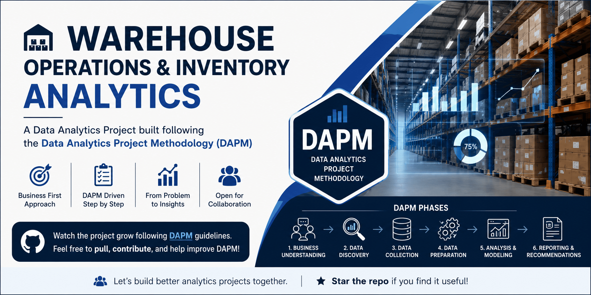

# Warehouse Operations & Inventory Analytics

  

A business-first Data Analytics case study focused on warehouse operations, inventory management, and decision support.

This project follows the **[Data Analytics Project Methodology (DAPM Framework) v1.0](https://github.com/subircodz/data-analytics-project-methodology)** and is being developed incrementally, with each phase completed and documented before moving to the next.

## Project Status

✅ Phase 1 – Business Understanding   
✅ Phase 2 - Stakeholder Analysis  
**Current Phase:** 🟡 Phase 3 - Business Requirements  

The project is actively evolving. New documents, datasets, analyses, and reports will be added as required by the methodology.

## Project Documentation

| Document                    | Purpose                                                                                                                                    |
| --------------------------- | ------------------------------------------------------------------------------------------------------------------------------------------ |
| **[PROJECT_BRIEF](docs/01_PROJECT_BRIEF.md)**        | Provides a high-level overview of the case study, business problem, objectives, scope, and current project status.                         |
| **[PROJECT_CASE_JOURNAL](docs/02_PROJECT_CASE_JOURNAL.md)** | Records the consultant–client discussions, questions, and decisions made throughout each DAPM phase.                                       |
| **[OBSERVATIONS](docs/04_OBSERVATIONS.md)**         | Summarizes the key business findings, conclusions, and outcomes identified during each project phase.                                      |
| **[ANALYTICAL_THINKING](docs/03_ANALYTICAL_THINKING.md)**  | Captures the consultant's evolving analytical ideas, potential metrics, stakeholder information needs, and future analysis considerations. |
| **[PHASE_CHECKLIST](docs/05_PHASE_CHECKLIST.md)**      | Tracks the completion criteria and progress of each DAPM phase.                                                                            |

For the complete project journey, refer to the above documents.

## License

This project is licensed under the MIT License. See the [LICENSE](LICENSE) file for details.