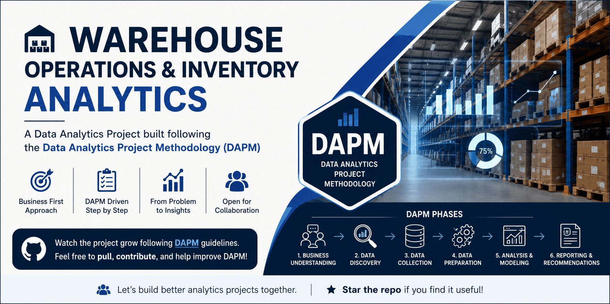
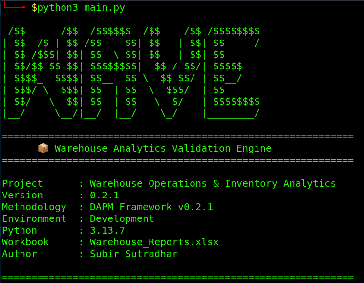
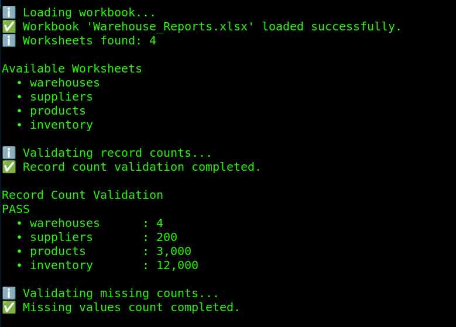
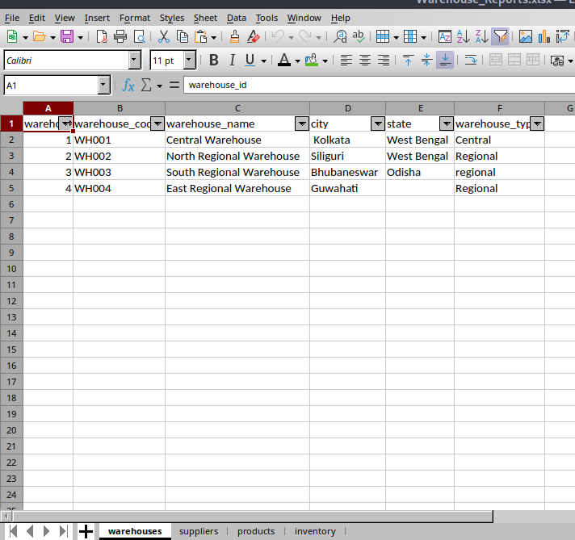

# Warehouse Operations & Inventory Analytics

<p align="center">
    
</p>

> **A flagship Data Analytics Capstone Project that demonstrates how real business problems are solved using a structured, business-first analytics methodology.**

This repository showcases an end-to-end Warehouse Operations & Inventory Analytics case study developed using the **Data Analytics Project Methodology (DAPM) v0.2.1**.

Rather than starting with dashboards, the project follows the complete analytics lifecycle—from understanding the business problem to delivering evidence-based business recommendations.

Every phase follows DAPM, ensuring that business understanding, data preparation and analysis are completed in a structured and reproducible manner.

---

# What This Project Demonstrates

This project demonstrates how a professional Data Analyst approaches a real business problem in an enterprise environment.

The project covers the complete analytics lifecycle, including:

- Project Planning
- Business Understanding
- Stakeholder Analysis
- Business Requirements
- Data Discovery
- Data Profiling
- Data Cleaning
- Data Validation
- Exploratory Data Analysis (EDA)
- Business Insights
- Business Recommendations
- Executive Summary

---

# Project Preview

## WAVE - Warehouse Analytics Validation Engine

<p align="center">
    
</p>

WAVE is the Python validation engine developed specifically for this project.

It validates business identifiers, referential integrity and business rules before analytical processing begins.

---

## WAVE Validation Report

<p align="center">
    
</p>

Business Identifier, Referential Integrity and Business Rule validation summary generated by WAVE.

---

## Source Data

<p align="center">
    
</p>

Warehouse Operations workbook used throughout the project.

---

# Skills Demonstrated

## Business Analysis

- Business Understanding
- Stakeholder Analysis
- Requirement Gathering
- Business Process Analysis
- Analytical Thinking

---

## Data Analytics

- Data Discovery
- Data Profiling
- Data Cleaning
- Data Validation
- Exploratory Data Analysis
- Business Insights
- Data Storytelling

---

## Software Engineering

- Python
- Pandas
- SQL
- MariaDB
- Microsoft Excel
- Modular Python Architecture
- Configuration-Driven Design
- Validation Engine Development
- Git
- GitHub

---

# Project Methodology

This project follows the **Data Analytics Project Methodology (DAPM) v0.2.1**.

DAPM is a structured analytics framework that guides projects from business understanding through executive reporting using clearly defined phases, standardised documentation and professional engineering practices.

---

# Project Workflow

```text
Project Brief
        │
        ▼
Business Understanding
        │
        ▼
Stakeholder Analysis
        │
        ▼
Business Requirements
        │
        ▼
Data Discovery
        │
        ▼
Data Profiling
        │
        ▼
Data Cleaning
        │
        ▼
Data Validation
        │
        ▼
Exploratory Data Analysis
        │
        ▼
Business Insights
        │
        ▼
Business Recommendations
        │
        ▼
Executive Summary
```

---

# Project Principles

The project follows five guiding principles throughout the analytics lifecycle.

- Business before Technology
- Observe before Cleaning
- Clean before Validation
- Validate before Analysis
- Evidence before Recommendation

---

# Project Status Legend

| Status | Meaning |
|:------:|---------|
| ✅ | Completed |
| 🚧 | In Progress |
| ⏳ | Planned |

---

# Project Documentation

| Phase | Status | Purpose |
|------|:------:|-------------|
| [01 · Project Brief](docs/01_PROJECT_BRIEF.md) | ✅ | Introduces the business case, project objectives and scope. |
| [02 · Business Understanding](docs/02_BUSINESS_UNDERSTANDING.md) | ✅ | Documents the warehouse business, operational workflow and business challenges. |
| [03 · Stakeholder Analysis](docs/03_STAKEHOLDER_ANALYSIS.md) | ✅ | Identifies stakeholders, responsibilities and information needs. |
| [04 · Business Requirements](docs/04_BUSINESS_REQUIREMENTS.md) | ✅ | Defines business questions, reporting requirements and analytical objectives. |
| [05 · Data Discovery](docs/05_DATA_DISCOVERY.md) | ✅ | Identifies available business systems and required datasets. |
| [06 · Data Profiling](docs/06_DATA_PROFILING.md) | 🚧 | Examines the structure and quality of the raw datasets before any modifications. |
| [07 · Data Cleaning](docs/07_DATA_CLEANING.md) | ⏳ | Cleans and standardises the datasets for reliable analysis. |
| [08 · Data Validation](docs/08_DATA_VALIDATION.md) | ⏳ | Validates business identifiers, referential integrity and business rules. |
| [09 · Exploratory Data Analysis](docs/09_EDA_REPORT.md) | ⏳ | Explores patterns, relationships and anomalies within the data. |
| [10 · Business Insights](docs/10_BUSINESS_INSIGHTS.md) | ⏳ | Converts analytical findings into meaningful business insights. |
| [11 · Recommendations](docs/11_RECOMMENDATIONS.md) | ⏳ | Provides evidence-based business recommendations. |
| [12 · Executive Summary](docs/12_EXECUTIVE_SUMMARY.md) | ⏳ | Summarises the project for business stakeholders and decision makers. |

---

# Project Artifacts

| Document | Status | Purpose |
|----------|:------:|---------|
| [Project Summary](docs/13_PROJECT_SUMMARY.md) | 🚧 | Provides a high-level overview of the project and current progress. |
| [Observations Register](docs/14_OBSERVATIONS.md) | 🚧 | Records verified observations throughout the project lifecycle. |
| [Analytical Thinking Register](docs/15_ANALYTICAL_THINKING.md) | 🚧 | Records assumptions, hypotheses and analytical decisions. |
| [Phase Checklist](docs/16_PHASE_CHECKLIST.md) | 🚧 | Tracks the completion status of every DAPM phase. |
| [Project Journal](docs/PROJECT_JOURNAL.md) | 🚧 | Records the chronological engineering and analytical journey of the project. |

---

# Project Architecture

The same business problem is solved using three different technologies.

```text
                    Warehouse Dataset
                           │
        ┌──────────────────┼──────────────────┐
        │                  │                  │
        ▼                  ▼                  ▼
 Spreadsheet         SQL Validation      WAVE (Python)
 Validation           & Validation          Engine
        │               Profiling             │
        └──────────────────┼──────────────────┘
                           │
                           ▼
                  Clean & Trusted Data
                           │
                           ▼
                  Exploratory Analysis
                           │
                           ▼
                   Business Insights
                           │
                           ▼
                 Business Recommendations
```

---

# Repository Structure

```text
Warehouse-Operations-And-Inventory-Analytics/

# Repository Structure

```text
Warehouse-Operations-And-Inventory-Analytics/

├── assets/                    # Images used throughout the documentation
│
├── data/
│   ├── raw/                   # Original source datasets
│   └── processed/             # Cleaned datasets (generated later)
│
├── docs/                      # DAPM project documentation
│
├── src/
│   │
│   ├── 01-spreadsheet/        # Spreadsheet-based profiling and validation
│   │   ├── validation/
│   │   ├── screenshots/
│   │   └── README.md
│   │
│   ├── 02-sql/                # SQL implementation
│   │   ├── data-validation/
│   │   ├── screenshots/
│   │   └── README.md
│   │
│   └── 03-python/             # WAVE Validation Engine
│       ├── analysis/
│       ├── preparation/
│       ├── readers/
│       ├── validators/
│       ├── reports/
│       ├── visualization/
│       ├── tests/
│       ├── utils/
│       ├── output/
│       ├── docs/
│       ├── models/
│       ├── screenshots/
│       ├── config.py
│       ├── main.py
│       └── README.md
│
└── README.md
```

---

# Current Phase

## **Data Profiling**


Understanding the structure and quality of the raw datasets before performing any data cleaning or validation activities.

---

# About this Repository

This repository is designed as a flagship portfolio project.

Its objective is to demonstrate more than technical implementation.

It showcases how a Data Analyst approaches a real business problem—from understanding business objectives to preparing reliable data, generating evidence-based insights and communicating recommendations through professional documentation.

The project combines business analysis, analytical thinking and software engineering into a single end-to-end case study.

---

# License

This project is licensed under the MIT License.

See the [LICENSE](LICENSE) file for more information.