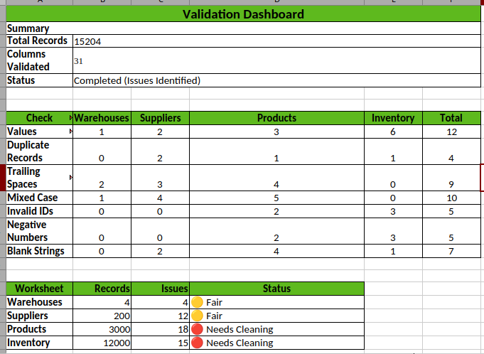

# Spreadsheet Validation

## Purpose

The purpose of this phase is to perform an initial quality assessment of the raw warehouse dataset using spreadsheet software.

Spreadsheet validation provides a quick visual inspection of the data before moving to SQL- and Python-based validation. This step helps identify obvious data quality issues that can be detected through filtering, sorting, conditional formatting, and manual review.

---

## Dataset

**Source**

[data/raw/excel/Warehouse_Reports.xlsx](../../data/raw/excel/Warehouse_Reports.xlsx)

Worksheets validated:

- Warehouses
- Suppliers
- Products
- Inventory

---

## Validation Objectives

The spreadsheet validation focused on identifying common data quality issues, including:

- Missing values
- Duplicate records
- Leading and trailing spaces
- Mixed letter casing
- Invalid identifiers
- Negative numeric values
- Blank strings
- Overall worksheet health

---

## Validation Dashboard

A consolidated validation dashboard was created inside the workbook to summarize all findings.

The dashboard provides:

- Total records validated
- Total columns validated
- Validation status
- Data quality issues by worksheet
- Overall worksheet health

This approach provides a concise executive summary without requiring detailed inspection of every worksheet.

---

## Validation Result

The validation identified multiple data quality issues across the warehouse dataset.

These issues were intentionally retained because the objective of this project is to demonstrate a complete data analytics workflow, including:

- Data Validation
- Data Cleaning
- Data Preparation
- Exploratory Data Analysis
- Business Insights

No records were modified during this phase.

---

## Evidence

### Validation Dashboard

    
</>

---

## Next Step

Proceed to SQL Validation to verify data integrity, uniqueness, and business rules using database queries.

---

## Navigation

| Document | Link |
|----------|------|
| Data Validation | [CLICK](../README.md) |
| SQL Validation | [CLICK](../02-sql/README.md) |
| Python Validation | [CLICK](../03-python/README.md) |