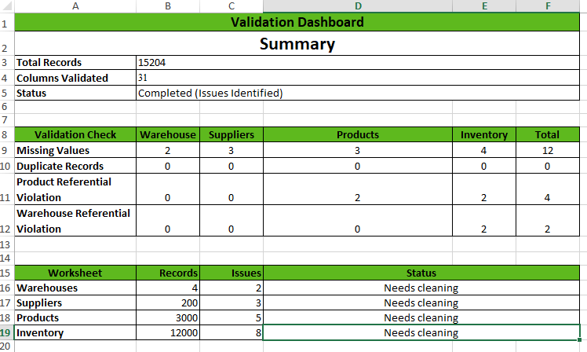

# Spreadsheet Validation

## Purpose

This validation was performed to assess the quality of the raw warehouse dataset before it entered the SQL and Python validation stages.

Spreadsheet software provides an efficient way to visually inspect the data and identify obvious quality issues that may affect downstream analysis.

This phase focuses on discovering data quality problems rather than correcting them.

---

## Dataset Used

**Workbook**

[../data/raw/excel/Warehouse_Reports.xlsx](../data/raw/excel/Warehouse_Reports.xlsx)

The workbook contains the following worksheets:

| Worksheet | Description |
|-----------|-------------|
| Warehouses | Warehouse master information |
| Suppliers | Supplier master information |
| Products | Product master information |
| Inventory | Current warehouse inventory |

---

## Validation Approach

Each worksheet was reviewed using standard spreadsheet capabilities.

The validation process included:

- Sorting and filtering records
- Detecting duplicate values
- Identifying missing data
- Reviewing text consistency
- Inspecting identifier fields
- Verifying numeric values
- Recording findings in a consolidated validation dashboard

No modifications were made to the source dataset during this phase.

---

## Spreadsheet Features Used

The following spreadsheet features were used during validation.

| Feature | Purpose |
|----------|---------|
| Auto Filter | Review and isolate records |
| Sort (Ascending / Descending) | Detect inconsistencies and ordering issues |
| Conditional Formatting | Highlight duplicate values |
| COUNTA() | Count populated cells |
| COUNTBLANK() | Identify missing values |
| COUNTIF() | Detect duplicate values |
| SUM() | Verify numeric totals where applicable |
| Freeze Panes | Improve worksheet navigation |
| Multiple Worksheets | Cross-reference master data |

---

## Validation Dashboard

A consolidated Validation Dashboard was created inside the workbook.

The dashboard summarizes:

- Worksheets validated
- Records processed
- Columns validated
- Data quality observations
- Worksheet health

This approach provides a concise overview without requiring reviewers to inspect every worksheet individually.

---

## Findings

The validation identified several data quality issues that were intentionally retained for subsequent project phases.

Examples include:

- Missing values
- Duplicate records
- Invalid identifiers
- Mixed letter casing
- Leading and trailing spaces
- Negative numeric values
- Blank strings

These observations will be addressed during the Data Cleaning phase.

---

## Deliverables

- Warehouse_Reports.xlsx
- Validation Dashboard in the excel file
- Supporting screenshots

---

### Validation Dashboard

    
</>

---

## Next Step

Proceed to SQL Validation to verify data integrity, uniqueness, and business rules using database queries.

---

## Navigation

| Document | Link |
|----------|------|
| Data Validation | [CLICK](../../docs/06_DATA_VALIDATION.md) |
| SQL Validation | ⏳ [CLICK](../02-sql/README.md) |
| Python Validation | ⏳ [CLICK](../03-python/README.md) |
| Data Discovery | [CLICK](../../docs/05_DATA_DISCOVERY.md) |

---

