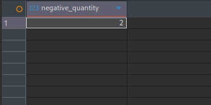

# SQL Data Validation

## Purpose

After completing the spreadsheet-based data discovery, the next step was to validate the same dataset using SQL.

The objective of this phase was not only to write SQL queries, but also to verify the quality, consistency and integrity of the warehouse data directly from the database.

This validation helped confirm whether the observations made during spreadsheet analysis still held true after the data was loaded into MariaDB.

---

## Validation Objectives

During this phase, the following checks were performed:

- Verify successful database import
- Verify table structure
- Validate record counts
- Check missing values
- Validate business keys
- Verify referential integrity
- Validate business rules
- Document observations

---

## Validation Workflow

```
Import Database
        │
        ▼
Verify Schema
        │
        ▼
Validate Record Counts
        │
        ▼
Missing Value Analysis
        │
        ▼
Business Key Validation
        │
        ▼
Referential Integrity Validation
        │
        ▼
Business Rule Validation
        │
        ▼
Document Findings
```

---

# Validation Categories

## 1. Schema Validation

Verified that all expected tables were imported successfully and the table structures matched the generated dataset.

Tables validated:

- Warehouses
- Suppliers
- Products
- Inventory

---

## 2. Record Count Validation

The total number of records in each table was verified after database import.

| Table | Records |
|--------|--------:|
| Warehouses | 4 |
| Suppliers | 199 |
| Products | 2,999 |
| Inventory | 12,000 |

**Total Records:** **15,202**

This confirmed that all datasets were imported successfully without any record loss.

---

## 3. Missing Value Validation

Missing values were identified directly from the database using SQL queries.

Summary:

| Table | Columns with Missing Values |
|--------|-----------------------------|
| Warehouses | state |
| Suppliers | gst_number |
| Products | supplier_id, product_name |
| Inventory | warehouse_id, product_id, batch_number |

Instead of correcting the data immediately, these records were retained intentionally for downstream validation and data cleaning exercises.

---

## 4. Business Key Validation

Business identifiers were validated to ensure duplicate business records were not created.

Validated Keys:

- Product SKU
- Supplier Code
- Warehouse Code
- Warehouse + Product + Batch combination

No duplicate business keys were identified during validation.

---

## 5. Referential Integrity Validation

Relationships between master and transactional tables were validated.

Relationships checked:

- Inventory → Products
- Products → Suppliers
- Suppliers → Products
- Warehouses → Inventory

The objective was to identify orphan records and verify that business relationships remained consistent after import.

---

## 6. Business Rule Validation

Business rules were validated using SQL queries.

Rules checked included:

- Negative Quantity
- Negative Unit Cost
- Negative Product Price
- Negative Reorder Level
- Product Status
- Supplier Status

These checks helped identify records that could potentially impact reporting accuracy.

---

# SQL Techniques Used

During this validation phase the following SQL concepts were applied.

- SELECT
- WHERE
- COUNT()
- DISTINCT
- GROUP BY
- HAVING
- LEFT JOIN
- Aggregate Functions

The focus of this phase was practical data validation rather than learning isolated SQL syntax.

---

# Validation Summary

| Validation | Status |
|------------|:------:|
| Database Import | ✅ |
| Schema Validation | ✅ |
| Record Count Validation | ✅ |
| Missing Value Validation | ✅ |
| Business Key Validation | ✅ |
| Referential Integrity Validation | ✅ |
| Business Rule Validation | ✅ |

---

# Evidence

### SQL Validation Summary


---

### Duplicate Validation


---

### Referential Integrity Validation


---

### Business Rule Validation



---

## Navigation

| Document | Link |
|----------|------|
| Data Validation | [CLICK](../../docs/06_DATA_VALIDATION.md) |
| Spreadsheet Validation | [CLICK](../01-spreadsheet/README.md) |
| Python Validation | [CLICK](../03-python/README.md) |
| Data Discovery | [CLICK](../../docs/05_DATA_DISCOVERY.md) |