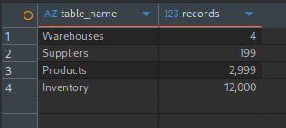
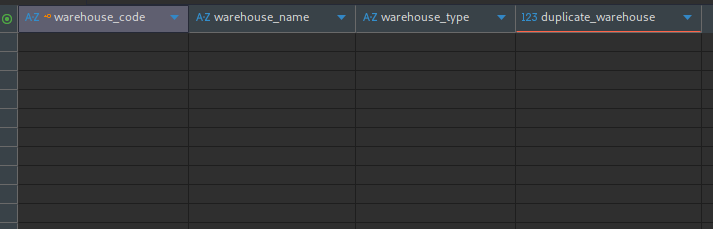
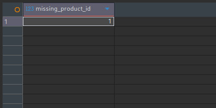

# SQL Data Validation

> **Module:** Data Validation – SQL  
> **Status:** ✅ Completed

---

## Purpose

SQL validation provides a database-level assessment of the warehouse dataset after it has been imported into MariaDB.

This phase verifies data quality using SQL queries and complements the Spreadsheet Validation by validating the same dataset in a relational database environment.

No changes are made to the source data during this phase.

---

# Dataset

The following tables were validated.

| Table | Description |
|--------|-------------|
| Warehouses | Warehouse master data |
| Suppliers | Supplier master data |
| Products | Product master data |
| Inventory | Inventory transactions |

---

# Validation Scope

The following validation checks were performed.

- Record count validation
- Missing value validation
- Duplicate record validation
- Identifier validation
- Referential integrity validation 

---

# Validation Workflow

```text
Import Dataset
       │
       ▼
Record Count Validation
       │
       ▼
Missing Value Validation
       │
       ▼
Duplicate Validation
       │
       ▼
Identifier Validation
       │
       ▼
Referential Integrity Validation
       │
       ▼
Document Findings
```

---

# Validation Categories

## Record Count Validation

Verified that all expected records were imported successfully into the database.

---

## Missing Value Validation

Checked each table for missing values using SQL queries.

---

## Duplicate Record Validation

Validated duplicate records across all tables using SQL.

---

## Identifier Validation

Verified identifier columns for invalid or duplicate values.

---

## Referential Integrity Validation

Validated relationships between related tables to identify orphan records.

---

# SQL Techniques Used

The validation queries use the following SQL concepts.

- SELECT
- WHERE
- COUNT()
- GROUP BY
- HAVING
- JOIN
- Aggregate Functions

---

# Validation Summary

| Validation | Status |
|------------|:------:|
| Schema Understanding | ✅ |
| Record Count | ✅ |
| Missing Values | ✅ |
| Duplicate Records | ✅ |
| Business Key Validation | ✅ |
| Business Rule Validation | ✅ |
| Referential Integrity | ✅ 
---

# Evidence

## Validation Summary



---

## Duplicate Validation



---

## Referential Integrity Validation



---

# Next Phase

Proceed to Python Validation to automate the same validation checks using Pandas.

---

## Navigation

| Document | Link |
|----------|------|
| Data Validation | [06_DATA_VALIDATION.md](../../docs/06_DATA_VALIDATION.md) |
| Spreadsheet Validation | [README.md](../01-spreadsheet/README.md) |
| Python Validation | [README.md](../03-python/README.md) |
| Data Discovery | [05_DATA_DISCOVERY.md](../../docs/05_DATA_DISCOVERY.md) |